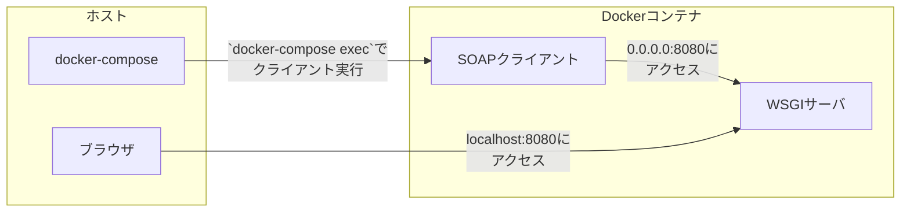

## 環境

- WSL2 (結論関係ない)
- gunicorn
- docker-compose

## 現象

[このコード](https://github.com/ryoutoku/gunicorn-soap)の検証時の話。
コンテナ内/外から同時にコンテナ内サーバにアクセスしたとき、どちらかがタイムアウトして Response を取得できない現象が発生。

### 発生時の構成など

#### アクセス方法

- コンテナ外アクセスとして、ブラウザから http://localhost:8080/?wsdl にアクセス
- コンテナ内アクセスとして、`docker-compose exec`を実行してコンテナ内からクライアントを実行

#### 図解



#### gunicorn の設定

```yaml:docker-compos・・.yaml
    # 中略
    ports:
      - 127.0.0.1:8080:8080
    command: >
      gunicorn src.wsgi:app -b 0.0.0.0:8080
      --max-requests 500
      --max-requests-jitter 200
```

## 結論

`gunicorn`を並列実行するよう起動する。
上記リポジトリでは以下の様に`workers`と`threads`を追加した。

```yaml:docker-compose.yaml
    # 中略
    ports:
      - 127.0.0.1:8080:8080
    command: >
      gunicorn src.wsgi:app -b 0.0.0.0:8080
      --workers 4
      --threads 2
      --max-requests 500
      --max-requests-jitter 200
```

## 原因

`gunicorn`は起動時に指定しないと、シングルスレッド、シングルプロセス(`workers=1`, `threads=1`)で実行されるため、同時に実行された時はどちらかがタイムアウトする。

デフォルト値はこちら。

- [workers](https://docs.gunicorn.org/en/stable/settings.html#workers)
- [threads](https://docs.gunicorn.org/en/stable/settings.html#threads)

## 学び

意味のある粒度で production と同じ設定を使う様にする事で、無駄な調査をする必要がなくなる。
